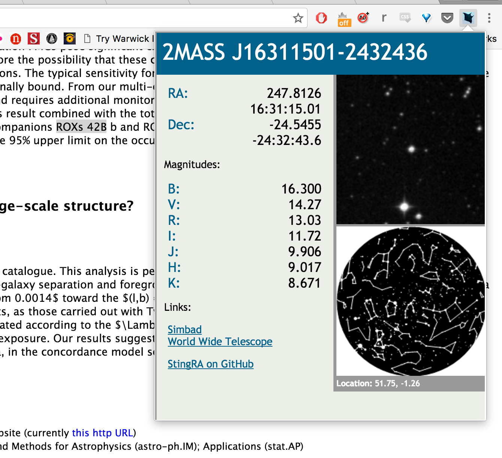

# StingRA

Chrome Extension to lookup astronomical objects for quick preview and links to WWT &amp; Simbad

Created at dot astronomy 8, Oxford UK

To install:
  1. Clone or download StingRA from github
  2. Type chrome://extensions, click the "Developer Mode" tickbox.
  3. Click "Load unpacked extension" and select the StingRA directory
  4. Start StingRA-ing!

#dotastro 8

